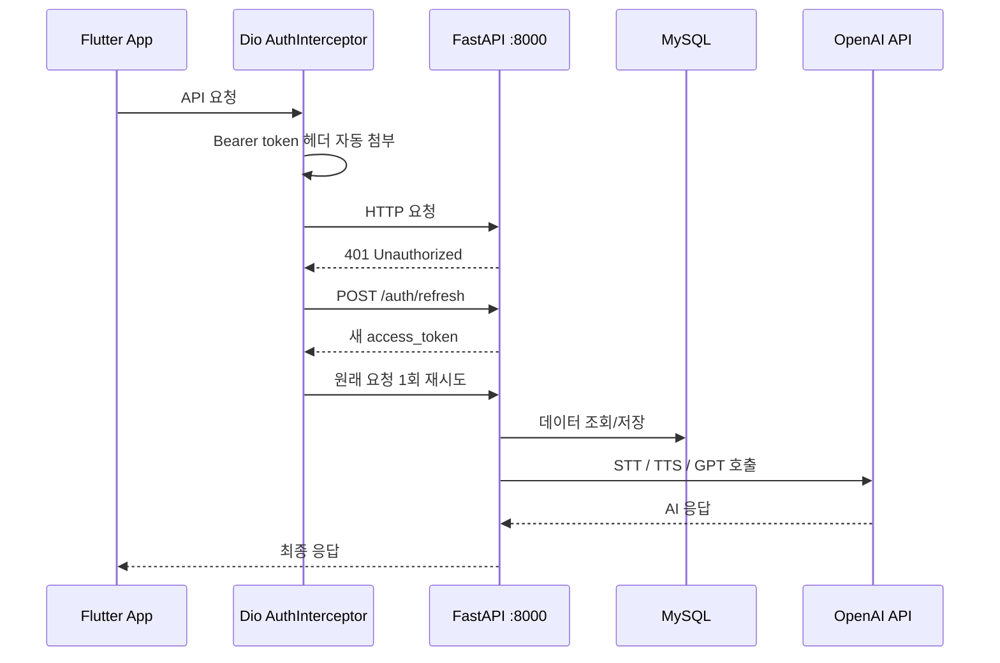

# Sprout English 🌱

> AI 기반 개인화 영어 말하기 · 쓰기 학습 모바일 앱

[](https://flutter.dev)
[](https://fastapi.tiangolo.com)
[](https://python.org)
[](LICENSE)

> 2026 남서울대학교 지능정보통신공학과 졸업작품전시회 출품작

---

## 프로젝트 개요

Sprout English는 AI가 1:1 코치 역할을 수행하는 모바일 영어 학습 앱입니다.

음성 녹음으로 말하기 연습을 하면 OpenAI Whisper가 전사(STT)하고, GPT가 발음·유창성·표현을 분석해 즉각 피드백을 제공합니다. 텍스트 교정, 역할극, TOEIC Writing, SRS 단어 복습까지 영어 학습에 필요한 핵심 기능을 하나의 앱에 통합했습니다.

### 주요 특징

- 실시간 AI 음성 대화 (WebSocket 스트리밍)
- OpenAI Whisper STT + TTS 파이프라인
- SM-2 알고리즘 기반 단어 복습 (SRS)
- FastAPI + Flutter 풀스택 아키텍처
- Docker Compose 원클릭 서버 실행

---

## 주요 기능

| 기능 | 설명 |
|------|------|
| **AI 프리토킹** | 실시간 음성 대화 — WebSocket 스트리밍으로 AI와 자연스러운 영어 회화 |
| **AI 튜터 채팅** | 텍스트 기반 영어 대화, 표현 교정, 예문 제공 |
| **롤플레이** | 카페·공항·회의 등 실제 상황 역할극 시나리오 반복 연습 |
| **스피킹 평가** | 발음·WPM·침묵 비율·유창성 점수 자동 분석 및 시각화 |
| **문법/글쓰기 교정** | GPT 기반 실시간 교정 및 변경점 diff 피드백 |
| **TOEIC Writing** | TOEIC Writing 유형별 문제 풀이 및 AI 채점 |
| **SRS 단어 복습** | SM-2 알고리즘 기반 간격 반복 복습 시스템 |
| **오늘의 표현** | 매일 새로운 영어 표현 학습 |
| **학습 통계** | 연속 학습일, 세션 수, 점수 추이 시각화 |

---

## 기술 스택

### Frontend
| 기술 | 용도 |
|------|------|
| Flutter 3.41.4 (Dart ^3.9.2) | 크로스플랫폼 모바일 앱 |
| flutter_riverpod | 상태 관리 |
| go_router | 선언형 화면 라우팅 |
| dio | HTTP 통신 |
| web_socket_channel | 실시간 WebSocket |
| record / just_audio | 음성 녹음 및 재생 |

### Backend
| 기술 | 용도 |
|------|------|
| FastAPI + Uvicorn (Python 3.10) | REST API + WebSocket 서버 |
| OpenAI GPT-4o-mini | 대화 생성 / 문법 교정 / 채점 |
| OpenAI TTS (gpt-4o-mini-tts) | 음성 합성 |
| OpenAI Whisper | 음성 인식 (STT) |
| LangChain | AI 체인 구성 |
| SQLAlchemy (async) + MySQL 8.4 | 학습 데이터 저장 |
| Redis 7 | Docker Compose 준비 완료 · 기능 구현 예정 |
| WebSocket | 실시간 AI 스트리밍 |

### Infra
| 기술 | 용도 |
|------|------|
| Docker + Docker Compose | 서버 환경 컨테이너화 |
| Next.js (Node 20) | Claude API 연동 톤 변환 서비스 |
| MySQL 8.4 | 관계형 데이터베이스 |
| Redis 7-alpine | 인프라 준비 완료 (token blacklist · rate limiting 확장 예정) |
| GitHub Actions | CI — flutter analyze, flutter test, pytest |

---

## 시스템 아키텍처

```
┌─────────────────────────────────────────┐
│          Android / iOS 앱               │
│              (Flutter)                  │
└──────────┬──────────────┬───────────────┘
           │ HTTP/REST    │ WebSocket
           ▼              ▼
┌─────────────────────────────────────────┐
│           FastAPI 서버 (8000)           │
│                                         │
│  POST /speech/turn  ──▶ Whisper STT    │
│  POST /tts          ──▶ OpenAI TTS     │
│  WS   /ws/chat      ──▶ GPT 스트리밍  │
│  POST /writing/…    ──▶ GPT 교정       │
│  REST /vocab/…      ──▶ SRS 복습       │
│  REST /roleplay/…   ──▶ 역할극 생성   │
│  GET  /healthz      ──▶ 헬스체크       │
└──────┬──────────────────────────────────┘
       │
       ├──▶ MySQL 8.4 (학습 기록 / 점수 / 단어)
       ├──▶ Redis 7   (캐시 / 작업 큐)
       └──▶ OpenAI API (GPT / Whisper / TTS)

┌─────────────────────────────────────────┐
│       Next.js API 서버 (3000)           │
│  POST /api/paraphrase ──▶ Claude API   │
│  (톤 변환 / 패러프레이즈)               │
└─────────────────────────────────────────┘
```

### 요청 흐름 (인증 포함)



---

## 폴더 구조

```
Sprout-English/
├── lib/                          # Flutter 앱 소스
│   ├── main.dart                 # 앱 엔트리포인트 (SproutEnglishApp)
│   ├── app.dart                  # Riverpod + go_router 기반 앱
│   ├── router.dart               # 라우팅 설정
│   ├── config/                   # API 엔드포인트 설정
│   ├── core/
│   │   ├── audio/                # 음성 녹음/재생 컨트롤러
│   │   ├── network/              # HTTP 클라이언트, 서버 URL 설정
│   │   ├── profile/              # 사용자 프로필
│   │   ├── settings/             # 앱 설정 (서버 IP 등)
│   │   ├── statistics/           # 학습 통계 집계
│   │   └── theme/                # 공통 테마
│   ├── feature/                  # 기능별 페이지
│   │   ├── free_talk/            # AI 프리토킹
│   │   ├── roleplay/             # 롤플레이
│   │   ├── speaking/             # 스피킹 평가
│   │   ├── writing/              # 글쓰기 교정 / TOEIC Writing
│   │   ├── vocab/                # 단어 학습
│   │   ├── drill/                # 패턴 드릴
│   │   └── paraphrase/           # 톤 변환
│   ├── screens/                  # 주요 화면 위젯
│   └── widgets/                  # 공통 위젯
│
├── server/                       # FastAPI 백엔드
│   ├── app/
│   │   ├── main.py               # FastAPI 엔트리포인트
│   │   ├── config_loader.py      # 환경변수 / 설정
│   │   ├── models.py             # DB 모델 (SQLAlchemy ORM)
│   │   ├── schemas.py            # Pydantic 스키마
│   │   ├── db.py                 # DB 세션 관리
│   │   ├── ws.py                 # WebSocket 핸들러
│   │   ├── tts.py                # TTS 라우터
│   │   ├── stt_pipeline.py       # STT 파이프라인
│   │   ├── routers/
│   │   │   ├── speaking.py       # 스피킹 평가 라우터
│   │   │   └── writing.py        # 글쓰기 교정 라우터
│   │   └── services/
│   │       ├── stt.py            # STT 서비스
│   │       ├── llm.py            # LLM 서비스
│   │       ├── scoring.py        # 발음/유창성 채점
│   │       ├── srs.py            # SRS (간격 반복) 알고리즘
│   │       ├── vocab_srs.py      # 단어 SRS
│   │       └── roleplay.py       # 역할극 생성
│   ├── requirements.txt
│   ├── Dockerfile
│   └── .env.example
│
├── vercel_api/                   # Next.js API (Claude 톤 변환)
│   ├── Dockerfile
│   └── .env.example
│
├── assets/
│   ├── roleplay/                 # 역할극 배경 이미지 및 카탈로그
│   └── toeic_writing_images/     # TOEIC Writing 이미지
│
├── docs/                         # 문서
│   ├── ARCHITECTURE.md
│   ├── TROUBLESHOOTING.md
│   └── screenshots/              # 스크린샷 가이드
│
├── docker-compose.yml
├── .env.example                  # Docker Compose MySQL 환경변수
└── README.md
```

---

## 스크린샷

> 스크린샷 촬영 가이드는 [docs/screenshots/README.md](docs/screenshots/README.md) 를 참고하세요.

---

## 실행 방법

### 방법 A — Docker (서버 백엔드 실행)

> **사전 준비:** [Docker Desktop](https://www.docker.com/products/docker-desktop/) 설치 필요

#### 1. 저장소 클론

```bash
git clone https://github.com/hamin1228/Sprout-English.git
cd Sprout-English
```

#### 2. 환경 변수 파일 생성

```bash
cp .env.example .env
cp server/.env.example server/.env
cp vercel_api/.env.example vercel_api/.env
```

| 파일 | 용도 |
|------|------|
| `.env` | Docker Compose MySQL 컨테이너 설정 |
| `server/.env` | FastAPI 서버 환경변수 (OpenAI Key, DB 접속 정보 등) |
| `vercel_api/.env` | Next.js API 환경변수 (Anthropic API Key) |

각 `.env` 파일을 열어 실제 값을 입력하세요 (아래 **환경변수 설정** 섹션 참고).

#### 3. 빌드 및 실행

```bash
docker compose up --build
```

#### 4. 접속 주소

| 서비스 | 주소 | 설명 |
|--------|------|------|
| FastAPI 백엔드 | http://localhost:8000 | STT / TTS / 대화 / 채점 |
| API 문서 (Swagger) | http://localhost:8000/docs | 자동 생성 API 문서 |
| Next.js API | http://localhost:3000 | 톤 변환 (Claude API) |
| MySQL | localhost:3307 | 학습 데이터 DB |
| Redis | localhost:6379 | 캐시 / 작업 큐 |

#### 유용한 명령어

```bash
# 백그라운드 실행
docker compose up -d --build

# 서비스별 로그 확인
docker compose logs -f backend
docker compose logs -f vercel-api

# 서비스 재시작
docker compose restart backend

# 전체 종료
docker compose down

# DB 데이터까지 완전 삭제
docker compose down -v
```

---

### 방법 B — 로컬 직접 실행 (Flutter 앱 개발 시)

**사전 준비:** Flutter SDK 3.41.4+, Python 3.10+, Node.js 20+, MySQL 8+, Redis, Android Studio

#### 1. 저장소 클론

```bash
git clone https://github.com/hamin1228/Sprout-English.git
cd Sprout-English
```

#### 2. FastAPI 백엔드 실행

```bash
cd server
cp .env.example .env          # OPENAI_API_KEY 등 실제 값 입력
pip install -r requirements.txt
uvicorn app.main:app --reload --host 0.0.0.0 --port 8000
```

#### 3. Next.js API 서버 실행 (선택)

```bash
cd ../vercel_api
cp .env.example .env          # ANTHROPIC_API_KEY 입력
npm install
npm run dev                   # http://localhost:3000
```

#### 4. Flutter 앱 실행

```bash
cd ..
flutter pub get
flutter run
```

#### 플랫폼별 서버 주소 설정

| 환경 | 서버 주소 | 설정 방법 |
|------|-----------|-----------|
| Android 에뮬레이터 | `http://10.0.2.2:8000` | 자동 설정 |
| Android 실기기 | `http://<Mac의 Wi-Fi IP>:8000` | 앱 Settings 화면에서 입력 |
| iOS 시뮬레이터 | `http://<Mac의 Wi-Fi IP>:8000` | 앱 Settings 화면에서 입력 또는 dart-define |
| iOS 실기기 | `http://<Mac의 Wi-Fi IP>:8000` | 앱 Settings 화면에서 입력 또는 dart-define |

> ⚠️ **실기기 연결 시 주의사항**
> - PC(Mac)와 휴대폰이 **같은 Wi-Fi**에 연결되어 있어야 합니다.
> - 서버는 반드시 `--host 0.0.0.0`으로 실행해야 합니다 (위 명령어 기준으로 이미 적용됨).
> - Mac의 Wi-Fi IP 확인: 시스템 설정 → Wi-Fi → 세부사항, 또는 터미널에서 `ipconfig getifaddr en0`
>
> **방법 1 — dart-define (빌드 시 고정):**
> ```bash
> flutter run --dart-define=ENGLISH_AI_SERVER_BASE_URL=http://192.168.x.x:8000
> ```
> **방법 2 — 런타임 설정 (재빌드 불필요):**
> 앱 실행 후 Settings 탭 → 서버 주소 입력란에 `http://192.168.x.x:8000` 입력

---

## 환경변수 설정

### server/.env 주요 항목

| 변수 | 설명 | 기본값 |
|------|------|--------|
| `OPENAI_API_KEY` | OpenAI API 키 (필수) | — |
| `DB_HOST` | MySQL 호스트 | `127.0.0.1` |
| `DB_PASSWORD` | MySQL 비밀번호 | — |
| `REDIS_URL` | Redis 연결 URL | `redis://localhost:6379/0` |
| `OPENAI_CHAT_MODEL` | GPT 모델명 | `gpt-4o-mini` |
| `OPENAI_TTS_MODEL` | TTS 모델명 | `gpt-4o-mini-tts` |
| `OPENAI_TTS_VOICE` | TTS 음성 | `nova` |
| `CORS_ORIGINS` | 허용 Origin (쉼표 구분) | `*` |
| `APP_ENV` | 실행 환경 | `development` |
| `LOG_LEVEL` | 로그 레벨 | `INFO` |

> 전체 항목은 [`server/.env.example`](server/.env.example) 참고

---

## 테스트 실행

### Flutter 테스트

```bash
# 정적 분석
flutter analyze

# 전체 테스트
flutter test

# 특정 테스트
flutter test test/widget_test.dart
```

### FastAPI 테스트

```bash
cd server
pip install -r requirements.txt
pytest tests/ -v
```

> FastAPI 테스트는 외부 API(OpenAI, MySQL, Redis)를 실제로 호출하지 않는 mock 기반으로 구성되어 있습니다.

---

## 저장소 / DB / Redis 구조

### 오디오 파일 저장

업로드된 오디오 파일은 아래 경로에 날짜별로 저장됩니다.

```
{STORAGE_LOCAL_PATH}/audio/{YYYYMMDD}/{trace_id}_{원본파일명}
```

| 환경 | 기본 경로 | Docker volume |
|------|-----------|---------------|
| 로컬 직접 실행 | `server/app/storage/audio/` | — |
| Docker | `/app/app/storage/audio/` | `audio_data` named volume |

- TTS 생성 파일은 시스템 임시 디렉터리(`tempfile.gettempdir()`)에 생성 후 즉시 삭제됩니다.
- 업로드 오디오 파일은 자동으로 삭제되지 않습니다. 주기적으로 정리가 필요하면 `server/app/core/audio.py`의 `cleanup_old_audio_files()` 함수를 수동으로 호출하세요.

```python
from app.core.audio import cleanup_old_audio_files
deleted = cleanup_old_audio_files("./app/storage/audio", max_age_hours=48)
print(f"{deleted}개 파일 삭제")
```

### DB 테이블 생성 방식

현재 앱 시작 시 `SQLAlchemy Base.metadata.create_all()`로 테이블을 자동 생성합니다.

- 위치: `server/app/db.py` → `init_db()`
- 호출 시점: `server/app/main.py` startup 이벤트 (백그라운드 태스크)
- **개발 환경에서는 이 방식으로 충분합니다.**
- **운영 배포 시에는 Alembic 마이그레이션 전환을 권장합니다** (아래 참고).

> ⚠️ `create_all()`은 기존 테이블을 삭제하거나 컬럼을 변경하지 않습니다. 스키마가 바뀌면 수동으로 DB를 수정하거나 Alembic을 사용해야 합니다.

### Alembic 마이그레이션 (향후 계획)

운영 환경에서 스키마 변경을 안전하게 관리하려면 Alembic 전환이 필요합니다.

```bash
# 도입 순서 (아직 적용 안 됨)
pip install alembic
alembic init migrations
# migrations/env.py 에 SQLAlchemy Base metadata 연결
alembic revision --autogenerate -m "init"
alembic upgrade head
```

### Redis 사용 현황

Redis 서비스는 Docker Compose에 구성되어 있으며 `REDIS_URL` 환경변수로 관리됩니다.

| 항목 | 상태 |
|------|------|
| Docker Compose 서비스 | ✅ 실행됨 (redis:7-alpine) |
| 코드에서 실제 사용 | ⚠️ 현재 미사용 (설정만 있음) |
| 향후 사용 계획 | rate limiting 외부 저장소, token blacklist |

---

## 보안 주의사항

- `server/.env`, `vercel_api/.env`, `.env` 파일은 **절대 Git에 커밋하지 마세요**. `.gitignore`에 등록되어 있습니다.
- 운영 환경에서는 `CORS_ORIGINS=*` 대신 허용할 도메인을 명시적으로 지정하세요.
  ```env
  CORS_ORIGINS=https://your-domain.com,https://app.your-domain.com
  ```
- `CORS_ORIGINS=*` 상태에서는 `allow_credentials=False`로 자동 설정됩니다 (브라우저 정책 준수).
- OpenAI API 키가 노출된 경우 즉시 [platform.openai.com/api-keys](https://platform.openai.com/api-keys) 에서 폐기하세요.
- Docker 컨테이너는 non-root 사용자(`appuser`)로 실행됩니다.

---

## 배포 / 시연 시 주의사항

- MySQL 초기 스키마는 앱 첫 실행 시 SQLAlchemy `create_all()`로 자동 생성됩니다.
- `docker compose up` 실행 전 반드시 세 개의 `.env` 파일이 모두 존재해야 합니다.
- Flutter 앱 실행 시 Settings 화면에서 서버 IP를 실제 서버 주소로 변경하세요.
- `OPENAI_API_KEY` 없이 실행하면 STT/TTS/GPT 기능이 개발용 stub으로 동작합니다.

---

## 개발 현황

### 완료
- [x] JWT 기반 사용자 인증 (회원가입 / 로그인 / 토큰 갱신 / 로그아웃)
- [x] 401 응답 시 refresh_token 자동 재시도 (Dio interceptor + bootstrap 흐름)
- [x] FastAPI 모듈 분리 (main.py → core/ + routers/ 구조)
- [x] CI 파이프라인 (GitHub Actions — flutter analyze, flutter test, pytest)
- [x] Flutter 인증 UI 및 Riverpod 기반 인증 상태 관리
- [x] AI 프리토킹 (WebSocket 실시간 스트리밍)
- [x] 스피킹 평가 (WPM / 침묵 비율 / 유창성 채점)
- [x] 글쓰기 교정 및 TOEIC Writing
- [x] SRS 단어 복습 (SM-2 알고리즘)
- [x] 롤플레이 시나리오 (카페 / 공항 / 회의)
- [x] 학습 통계 및 진도 시각화
- [x] Docker Compose 원클릭 배포 환경 (MySQL + Redis + FastAPI + Next.js)

### 진행 중
- [ ] 톤 변환(Paraphrase) UI 렌더링 완성
- [ ] 패턴 드릴 화면 구현

---

## 포트폴리오 포인트

본 프로젝트는 단순한 AI API 호출 예제가 아니라, 모바일 앱 · 백엔드 서버 · 인증 · DB · AI API 연동 · Docker 실행 환경까지 포함한 풀스택 구조로 설계한 졸업작품입니다.

### Flutter / Frontend (담당: 여하민)

| 항목 | 내용 |
|------|------|
| **상태 관리** | flutter_riverpod `NotifierProvider` 기반 인증 상태 + 화면 데이터 관리 |
| **라우팅** | go_router `redirect` 콜백으로 인증 여부에 따른 화면 자동 전환 |
| **JWT 인증 흐름** | 앱 시작 → `/auth/me` 검증 → 401 시 refresh 자동 재시도 → 실패 시 로그인 화면 |
| **토큰 갱신 Interceptor** | Dio `onError` interceptor로 401 발생 시 refresh → 원래 요청 1회 재시도, 동시 401 처리(Completer 패턴) |
| **음성 파이프라인** | `record` 패키지로 녹음 → WAV 파일 서버 전송 → TTS 응답 `just_audio`로 재생 |
| **WebSocket** | push-to-talk 방식으로 GPT 스트리밍 응답 실시간 렌더링 |
| **서버 주소 동적 설정** | dart-define + 런타임 Settings 화면에서 변경 가능 (재빌드 불필요) |
| **학습 통계** | 연속 학습일(streak), 세션 점수 추이, WPM/침묵 비율 시각화 |

### 기술적 고민과 해결

- **iOS 실기기 localhost 문제**: `server_config.dart`에서 플랫폼별 기본 URL 분기 + Settings 런타임 오버라이드로 재빌드 없이 IP 변경 가능하게 설계
- **동시 401 처리**: 여러 API 요청이 동시에 401을 받을 때 refresh를 1번만 실행하도록 `Completer<String?>` 큐 패턴 적용
- **토큰 보안 저장**: `flutter_secure_storage`로 Keychain / Android Keystore에 저장

### 현재 한계와 개선 예정

| 항목 | 현재 상태 | 개선 방향 |
|------|-----------|-----------|
| Redis 활용 | 인프라만 준비됨 | token blacklist · rate limiting 구현 |
| 오디오 파일 관리 | 날짜별 폴더에 누적 | Object Storage(S3 등) 전환 또는 자동 삭제 스케줄러 |
| DB 마이그레이션 | `create_all()` 자동 생성 | Alembic 마이그레이션 도입 |
| 로그아웃 보안 | 클라이언트 토큰 삭제만 | 서버 측 Redis blacklist로 강화 |
| 테스트 커버리지 | auth/핵심 API 중심 | Flutter 인증 컨트롤러 단위 테스트 확대 |
| iOS 배포 | 미완성 | TestFlight 배포 |

---

## 트러블슈팅

자세한 내용은 [docs/TROUBLESHOOTING.md](docs/TROUBLESHOOTING.md) 참고

### 앱에서 서버 연결이 안 되는 경우

- **에뮬레이터**: `localhost` 대신 Android 에뮬레이터는 `10.0.2.2`를 사용합니다 (자동 설정됨).
- **실기기**: PC와 휴대폰이 같은 Wi-Fi에 있어야 합니다. 앱 Settings 탭에서 `http://192.168.x.x:8000` 입력.
- **방화벽**: Mac의 경우 시스템 설정 → 방화벽에서 8000 포트 허용 여부 확인.
- **서버 실행 확인**: `curl http://localhost:8000/healthz` 가 `{"ok":true}` 를 반환하는지 확인.

### Docker에서 MySQL 연결 실패

```bash
docker compose ps          # mysql 상태 확인
docker compose logs mysql  # 에러 로그 확인
```

- `DB_HOST`는 Docker 환경에서 반드시 `mysql` (컨테이너 서비스명)이어야 합니다.
- `docker-compose.yml`의 `environment` 블록이 `server/.env`의 `DB_HOST`를 자동으로 오버라이드합니다.

### `docker compose up` 실패 — .env 파일 없음

```bash
cp .env.example .env
cp server/.env.example server/.env
cp vercel_api/.env.example vercel_api/.env
```

세 개의 `.env` 파일이 모두 존재해야 합니다.

### OpenAI API 오류

- `server/.env`의 `OPENAI_API_KEY` 값 확인
- 키가 없어도 서버는 실행됩니다. STT/TTS/GPT 기능이 stub(톤/에러 응답)으로 동작합니다.
- 서버 로그에서 `X-Trace-Id` 헤더로 특정 요청 추적 가능: `docker compose logs -f backend`

### Flutter 의존성 오류

```bash
flutter clean
flutter pub get
flutter analyze   # 정적 분석 오류 확인
```

### pytest 실행 오류

```bash
cd server
.venv/bin/python -m pytest tests/ -v   # venv 직접 지정
```

- 서버 외부에서 실행하면 `.venv` 가상환경이 아닌 시스템 Python이 사용될 수 있습니다.

### MySQL 포트 충돌

호스트 포트는 `3307`로 매핑됩니다 (로컬 MySQL 3306과 충돌 방지).

```bash
mysql -h 127.0.0.1 -P 3307 -u ea -p english_ai
```

---

## 팀원

| 이름 | 역할 |
|------|------|
| 강민서 | Backend / AI |
| 여인준 | Backend / AI |
| 여하민 | Frontend / Flutter |

지도교수: 정영화 교수님

---

## 개발 기간

2025.09 ~ 2026.06

---

## GitHub 저장소 설정 (관리자용)

아래 명령어로 저장소 설명과 topic을 설정할 수 있습니다:

```bash
gh repo edit hamin1228/Sprout-English \
  --description "AI-powered English speaking and writing learning app built with Flutter, FastAPI, OpenAI, MySQL, and Redis." \
  --add-topic flutter \
  --add-topic fastapi \
  --add-topic openai \
  --add-topic english-learning \
  --add-topic ai-tutor \
  --add-topic speech-to-text \
  --add-topic text-to-speech \
  --add-topic mysql \
  --add-topic redis \
  --add-topic docker \
  --add-topic graduation-project
```

---

## 인증 API 요약

### 엔드포인트

| Method | Endpoint | 설명 | 인증 필요 |
|--------|----------|------|-----------|
| POST | `/auth/signup` | 이메일/비밀번호 회원가입 | ❌ |
| POST | `/auth/login` | 로그인 → access/refresh token 발급 | ❌ |
| GET | `/auth/me` | 현재 로그인 유저 정보 조회 | ✅ Bearer |
| POST | `/auth/refresh` | refresh_token → 새 access_token 발급 | ❌ |
| POST | `/auth/logout` | 서버 응답 `{ok: true}` (클라이언트 토큰 삭제) | ✅ Bearer |

### 환경변수 (`server/.env`)

```env
JWT_SECRET_KEY=your-strong-random-secret   # 운영 환경에서 반드시 변경
JWT_ALGORITHM=HS256
ACCESS_TOKEN_EXPIRE_MINUTES=60
REFRESH_TOKEN_EXPIRE_DAYS=14
```

### curl 테스트 예시

```bash
# 회원가입
curl -X POST http://localhost:8000/auth/signup \
  -H "Content-Type: application/json" \
  -d '{"email":"test@example.com","password":"password123","nickname":"test"}'

# 로그인
curl -X POST http://localhost:8000/auth/login \
  -H "Content-Type: application/json" \
  -d '{"email":"test@example.com","password":"password123"}'

# 내 정보 조회 (ACCESS_TOKEN은 로그인 응답의 access_token)
curl http://localhost:8000/auth/me \
  -H "Authorization: Bearer <ACCESS_TOKEN>"

# 토큰 재발급
curl -X POST http://localhost:8000/auth/refresh \
  -H "Content-Type: application/json" \
  -d '{"refresh_token":"<REFRESH_TOKEN>"}'
```

### Flutter 실행 방법

```bash
# iPhone 실기기에서 Mac 로컬 서버에 연결
flutter run --dart-define=ENGLISH_AI_SERVER_BASE_URL=http://<맥북Wi-FiIP>:8000

# 예시
flutter run --dart-define=ENGLISH_AI_SERVER_BASE_URL=http://192.168.0.12:8000
```

> ⚠️ **iPhone 실기기 주의**: `localhost` / `127.0.0.1`은 iPhone 자기 자신을 의미합니다.  
> Mac 서버에 접속하려면 반드시 Mac의 Wi-Fi IP를 사용해야 합니다.  
> 앱 설정 화면에서 서버 주소를 런타임으로 변경하는 것도 가능합니다(재빌드 불필요).

### 앱 인증 흐름

1. 앱 실행 → secure storage에 access_token 확인
2. 토큰 있음 → `/auth/me` 호출 → 성공 시 홈 화면 이동
3. `/auth/me` 401 → refresh_token으로 `/auth/refresh` 자동 재시도 → 성공 시 홈 화면 이동
4. 토큰 없음 / refresh 실패 → 로컬 토큰 삭제 → 로그인 화면 표시
5. API 요청 중 401 → Dio interceptor가 refresh 자동 시도 → 성공 시 원래 요청 1회 재시도
6. 로그아웃 → Settings 탭 → 로그아웃 버튼 → 로컬 토큰 삭제 → 로그인 화면

### 로그아웃 방식

JWT stateless 방식이므로 서버는 `{ok: true}`만 반환합니다.  
Flutter 클라이언트에서 `flutter_secure_storage` 토큰을 삭제하는 방식으로 로그아웃합니다.  
추후 Redis token blacklist 방식으로 서버 측 무효화 확장 가능합니다.

---

## 라이선스

This project is licensed under the [MIT License](LICENSE).
